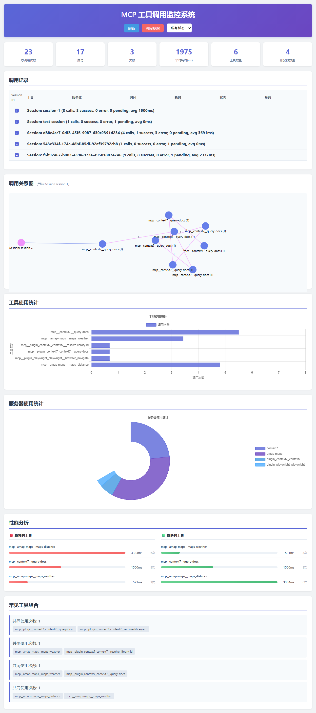

# MCP 工具调用监控系统

这是一个用于监控 MCP (Model Context Protocol) 工具在 Claude Code 中调用关系的系统。通过使用 Claude Code 的 hooks 机制，我们可以跟踪 MCP 工具的调用、记录调用信息，并可视化工具之间的调用关系。

## 功能特点

- 实时跟踪 MCP 工具的调用
- 记录详细的调用信息（时间、工具名称、参数、返回值）
- 可视化工具调用关系图
- 生成调用统计报告
- 支持多种输出格式（JSON、CSV、图表）

## 安装和配置

### 1. 配置 hooks

在项目根目录的 `.claude/settings.json` 文件中添加以下配置：

```json
{
  "hooks": {
    "PreToolUse": [
      {
        "matcher": "mcp__*",
        "hooks": [
          {
            "type": "command",
            "command": "cd D:/Code/mcp-monitor && node monitor/tracker.js --pre",
            "timeout": 30,
            "statusMessage": "Tracking MCP tool call..."
          }
        ]
      }
    ],
    "PostToolUse": [
      {
        "matcher": "mcp__*",
        "hooks": [
          {
            "type": "command",
            "command": "cd D:/Code/mcp-monitor && node monitor/tracker.js --post",
            "timeout": 30,
            "statusMessage": "Recording MCP tool result..."
          }
        ]
      }
    ]
  }
}
```

### 2. 安装依赖

```bash
cd D:\Code\mcp-monitor
npm install
```

### 3. 启动监控服务

```bash
npm run start
```

## 文件结构

```
mcp-monitor/
├── .claude/
│   └── settings.json          # Claude Code 配置文件
├── monitor/
│   ├── tracker.js             # 工具调用跟踪器
│   ├── database.js            # 数据存储管理
│   └── analyzer.js            # 数据分析器
├── frontend/
│   ├── index.html             # 主界面
│   ├── styles.css             # 样式文件
│   └── app.js                 # 前端应用
├── server/
│   ├── index.js               # 后端服务器
│   ├── routes/
│   │   └── api.js             # API 路由
│   └── middleware/
│       └── cors.js            # CORS 中间件
├── data/
│   └── calls.json             # 调用记录数据文件
├── package.json               # 项目依赖配置
└── README.md                  # 项目文档
```

## 使用方法

### 启动监控系统

```bash
npm run start
```

### 查看实时监控

打开浏览器访问 `http://localhost:3000`

### 程序运行截图



### 生成报告

```bash
npm run report -- --format json --output reports/calls.json
npm run report -- --format csv --output reports/calls.csv
npm run report -- --format html --output reports/calls.html
```

### 清除数据

```bash
npm run clear
```

### 关闭监控系统

#### 方法一：在启动终端中直接关闭
如果您是在命令行中直接运行 `npm run start` 启动的服务，可以在该终端窗口中按 `Ctrl + C` 组合键来终止服务。

#### 方法二：通过进程管理器关闭
1. 打开命令提示符（CMD）或 PowerShell
2. 执行以下命令查找占用 3000 端口的进程 ID（PID）：
   ```bash
   netstat -ano | findstr :3000
   ```
3. 执行以下命令强制终止该进程：
   ```bash
   taskkill -F -PID <进程ID>
   ```
   （将 `<进程ID>` 替换为上一步找到的实际进程ID）

#### 方法三：使用任务管理器
1. 打开任务管理器（Ctrl + Shift + Esc）
2. 在"详细信息"标签页中找到 node.exe 进程
3. 右键点击该进程并选择"结束任务"

## API 接口

### 获取所有调用记录

```http
GET /api/calls
```

参数：
- `limit`: 返回记录数限制（默认 100）
- `offset`: 偏移量（默认 0）
- `tool`: 工具名称过滤
- `startTime`: 开始时间（ISO 格式）
- `endTime`: 结束时间（ISO 格式）

### 获取工具统计

```http
GET /api/stats
```

### 获取调用关系图数据

```http
GET /api/graph
```

### 清除所有数据

```http
DELETE /api/calls
```

## 数据格式

调用记录的数据格式如下：

```json
{
  "id": "uuid-1234",
  "tool": "mcp__context7__query-docs",
  "server": "context7",
  "operation": "query-docs",
  "timestamp": "2026-05-30T11:00:00Z",
  "duration": 1200,
  "status": "success",
  "input": {
    "libraryId": "/vercel/next.js",
    "query": "How to use React hooks"
  },
  "output": {
    "result": "Documentation for React hooks..."
  },
  "context": {
    "sessionId": "abc123",
    "conversationId": "def456"
  }
}
```

## 技术栈

- **后端**: Node.js, Express
- **前端**: HTML, CSS, JavaScript, D3.js（图表可视化）
- **数据存储**: JSON 文件（可扩展到数据库）
- **部署**: 本地服务器，支持 Docker

## 扩展功能

### 支持的输出格式

- JSON: 结构化数据格式
- CSV: 表格数据格式
- HTML: 可视化报告
- PNG: 图表图片（使用 Puppeteer）

### 高级功能

- 调用链分析
- 工具依赖关系图
- 性能分析
- 异常检测
- 历史数据比较

## 开发说明

### 开发模式

```bash
npm run dev
```

### 运行测试

```bash
npm run test
```

### 代码格式化

```bash
npm run format
```

### 贡献指南

1. Fork 项目
2. 创建功能分支
3. 提交更改
4. 推送到分支
5. 提交 Pull Request

## 许可证

MIT License - 详见 LICENSE 文件
